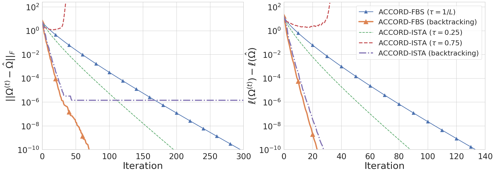
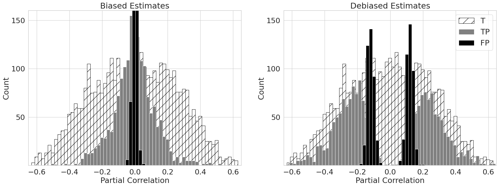
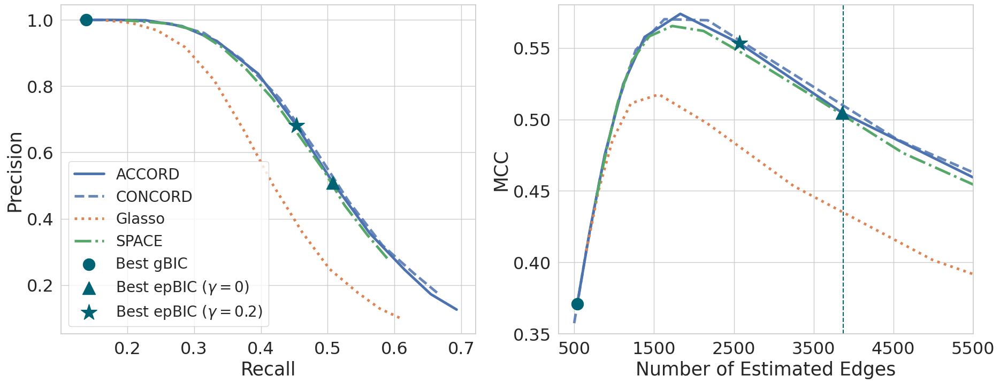
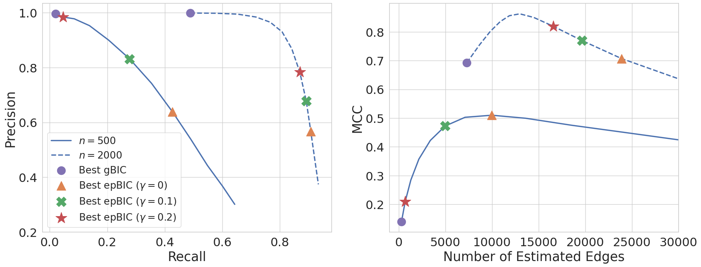

Reproducibility for the ACCORD Simulations
===============

This repository includes code to reproduce the results of the ACCORD simulations.

Installation
---------------

Install the package in development mode using the following command:
```
pip install -e .
```


Branch Structure
----------------

There are two branches: *master* and *apple-chip*. These branches contain different Docker images that may affect computing speed depending on the CPU type. Users familiar with codespace can create a codespace from the master branch and run simulations to reproduce results. Alternatively, users with Apple chips can clone the apple-chip branch and run simulations locally to optimize speed.

 - Note: The results obtained from these branches may differ slightly due to the utilization of different Docker images. The results corresponding to the manuscript are obtained from the master branch.


Directory Structure
-------------------

- __src__: It contains C++ source code for various versions of ACCORD & CONCORD algorithms.
- __gaccord__: It contains Python classes for the ACCORD & CONCORD algorithms.
- __simulation-convergence__: It contains code for reproducing results for the linear convergence property and numerical stability of the ACCORD-FBS algorithm. You can adjust the variable *sparsity* = {0.03, 0.15} to reproduce the corresponding results. The default is sparsity = 0.03, and the following figure can be obtained by running the *simulation-convergence.ipynb* notebook.
    - 
- __simulation-debiasing__: It contains code for reproducing results for debiasing experiments. You can adjust the variable *graph_structure* = {'hub_network', 'erdos_renyi'} to reproduce the corresponding results. The default is graph_structure = 'hub_network', and the following figure can be obtained by running the *simulation-debiasing.ipynb* notebook.
    - 
- __simulation-edge-detection__: It contains code for reproducing results for comparing edge detection rates between methods. You can adjust the variable *graph_structure* = {'hub_network', 'erdos_renyi'} to reproduce the corresponding results. The default is graph_structure = 'hub_network', and the following figure can be obtained by running the *simulation-edge-detection.ipynb* notebook.
    - 
- __simulation-model-selection__: It contains code for reproducing results for the behaviors of various model selection criteria. The following figure can be obtained by running the *simulation-model-selection.ipynb* notebook.
    - 
- __output__: All figures will be saved in this location after running notebooks.
  - __manuscript-figures__: It contains figures from the manuscript. The file names should be identical to the ones that will be saved in the parent directory for easy comparison.