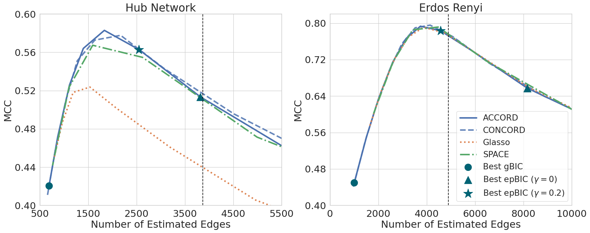

Reproducibility for the ACCORD Simulations
===============

This repository includes code to reproduce the results of the ACCORD simulations.

Installation
---------------

Install the package in development mode using the following command:
```
pip install -e .
```


Branch Structure
----------------

There are two branches: *master* and *apple-chip*. These branches contain different Docker images that may affect computing speed depending on the CPU type. Users familiar with codespace can create a codespace from the master branch and run simulations to reproduce results. Alternatively, users with Apple chips can clone the apple-chip branch and run simulations locally to optimize speed.

 - Note: The results obtained from these branches may differ slightly due to the utilization of different Docker images. The results corresponding to the manuscript are obtained from the master branch.


Directory Structure
-------------------

- __src__: It contains C++ source code for various versions of ACCORD & CONCORD algorithms.
- __gaccord__: It contains Python classes for the ACCORD & CONCORD algorithms.
- __simulation-convergence__: It contains code for reproducing results for the linear convergence property of the ACCORD-FBS algorithm (Figure 1 in manuscript). You can adjust the variable *sparsity* = {0.03, 0.15} in the second cell to reproduce the corresponding results, but the manuscript only includes results for sparsity = 0.15. The following figure can be obtained by running the *simulation-convergence.ipynb* notebook with sparsity = 0.15.
    - 
- __simulation-debiasing__: It contains code for reproducing results for debiasing experiments (Figure A1 in supplementary material). You can adjust the variable *graph_structure* = {'hub_network', 'erdos_renyi'} in the second cell to reproduce the corresponding results. The following figure can be obtained by running the *simulation-debiasing.ipynb* notebook with graph_structure = 'hub_network'.
    - 
- __simulation-edge-detection__: It contains code for reproducing results for comparing edge detection rates between methods (Figure 3 in manuscript). No need to adjust any variable for this simulation. The following figure can be obtained by running the *simulation-edge-detection.ipynb* notebook. The dashed vertical lines represent the number of edges in the true graphs.
    - 
- __simulation-parameter-estimation__: It contains code for reproducing results for comparing estimation errors between methods (Table 1 in manuscript and Table A1 in supplementary material). You can adjust the variable *graph_structure* = {'hub_network', 'erdos_renyi'} in the second cell to reproduce the corresponding results. The results will be printed in the last two cells of the notebook.
- __output__: All figures will be saved in this location after running notebooks.
  - __manuscript-figures__: It contains figures from the manuscript. The file names should be identical to the ones that will be saved in the parent directory for easy comparison.